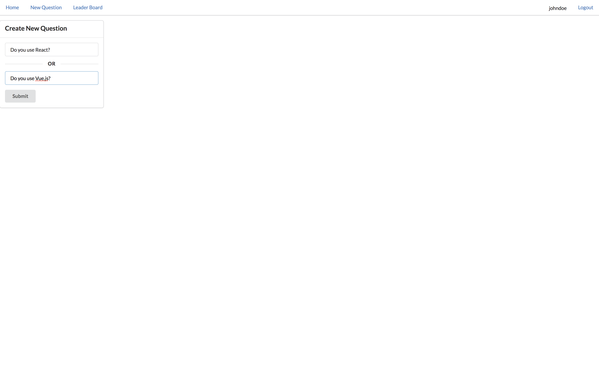

# Would You Rather App
React & Redux Project — Udacity React Developer Nanodegree

## TL;DR
This project consists in a small quiz game, of course built in React & Redux, that quizzes the user with questions in a "Would You Rather..." format. It allows the user to login, post questions and also vote on questions posted by other users.

## Features
### Login & Logout

User is forced to login before using other service.


User is redirected to unanswerd questions wen user login to service.<br/>

### Questions

User can choose the answer when user click the quesiton card.<br/>


User can see the quiz result only after answering the question.<br/>


User can make new question.<br/>
New question is added to unanswerd questions list.<br/>

### Leader board

User see the ranking. Ranking is determined by number of questions and answers.<br/>


## How to Load the App
```
1. git clone https://github.com/queuestack/nanodegree-would-you-rather.git
2. cd nanodegree-would-you-rather 
3. yarn
4. yarn start
```
