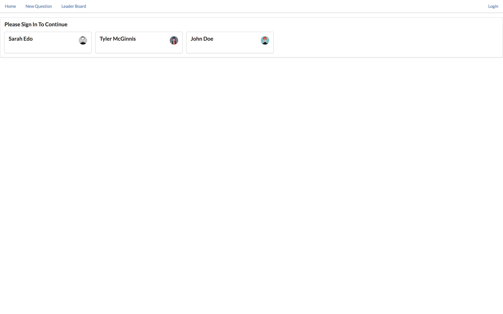

# Would You Rather App
React & Redux Project — Udacity React Developer Nanodegree

## TL;DR
This project consists in a small quiz game, of course built in React & Redux, that quizzes the user with questions in a "Would You Rather..." format. It allows the user to login, post questions and also vote on questions posted by other users.

## Features
### Login & Logout


User can't use other features if user don't login to service.
When user login to service, user is redirected to unanswerd questions.

## How to Load the App
```
1. git clone https://github.com/queuestack/nanodegree-would-you-rather.git
2. cd nanodegree-would-you-rather 
3. yarn
4. yarn start
```
